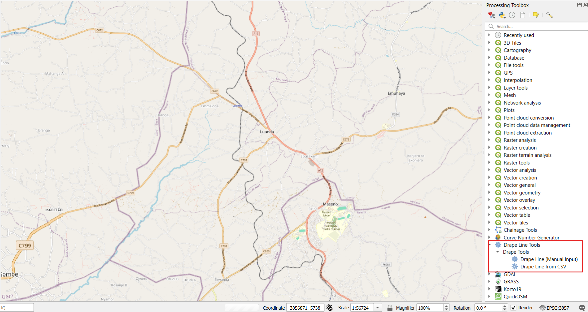
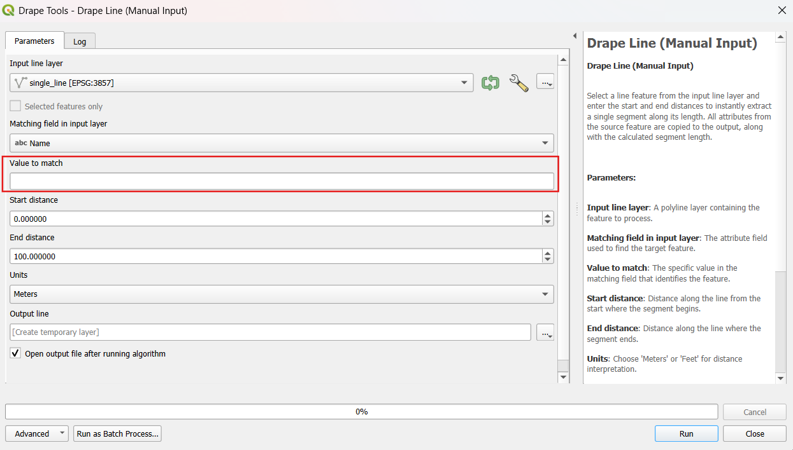
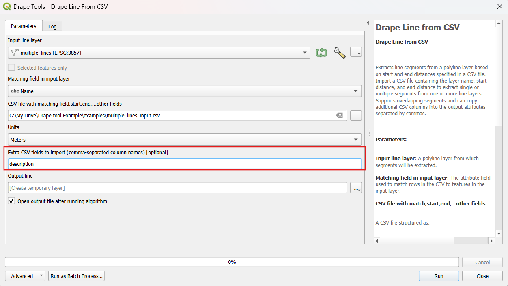
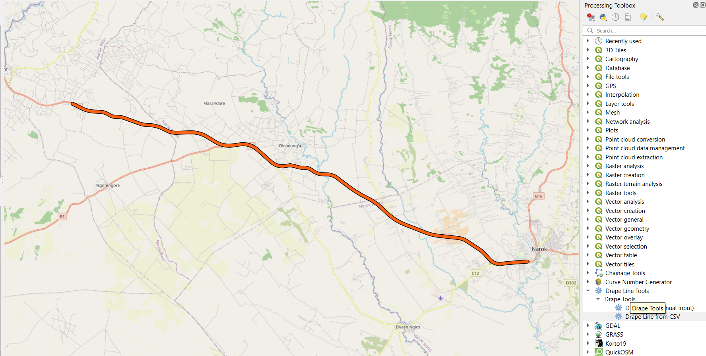
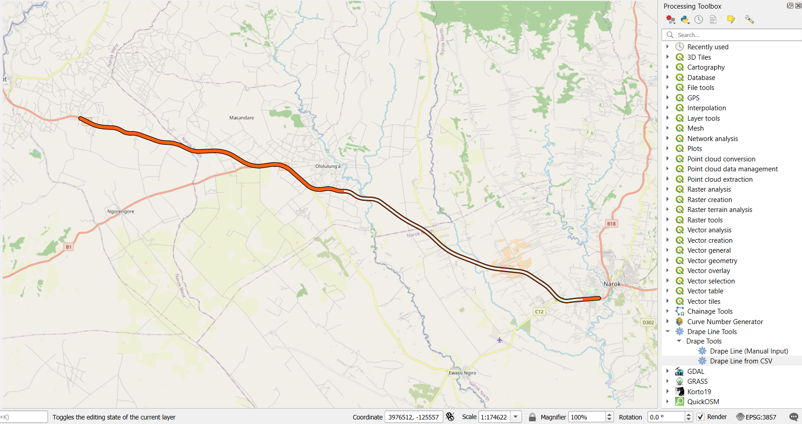

# Drape Line QGIS Plugin

## Overview
**Drape Line ** is a QGIS Processing plugin that allows users to create line segments along existing polylines by specifying start and end distances.  
It supports **manual input** or **CSV-based batch input** and includes enhanced usability features.

## New in This Release
- Added in-tool **Help documentation**.
- Added input field for **"Value to match"** in Manual Input.
- Added input option for **additional columns/attributes** in CSV input.
- Added support for **overlapping line segments** in CSV input.

## Usage

### 1. Manual Input
Specify:
- **Line Layer**
- **Value to match**
- **Start Distance**
- **End Distance**
- Outputs include the `start_dist`, `end_dist`, and `length_seg` attributes.

  

### 2. CSV Input
Provide a CSV file containing:
- Layer name
- Start distance
- End distance
- Optional extra attributes to join from the CSV.

### Output Example
**Before:**  

**After:**  

## Changelog
**vX.X.X**
- Added in-tool Help documentation.
- Added input field for 'Value to match' in Manual Input.
- Added input option for additional columns/attributes in CSV input.
- Added support for overlapping line segments in CSV input.

## License
This project is licensed under the terms of the LICENSE file included in the repository.
